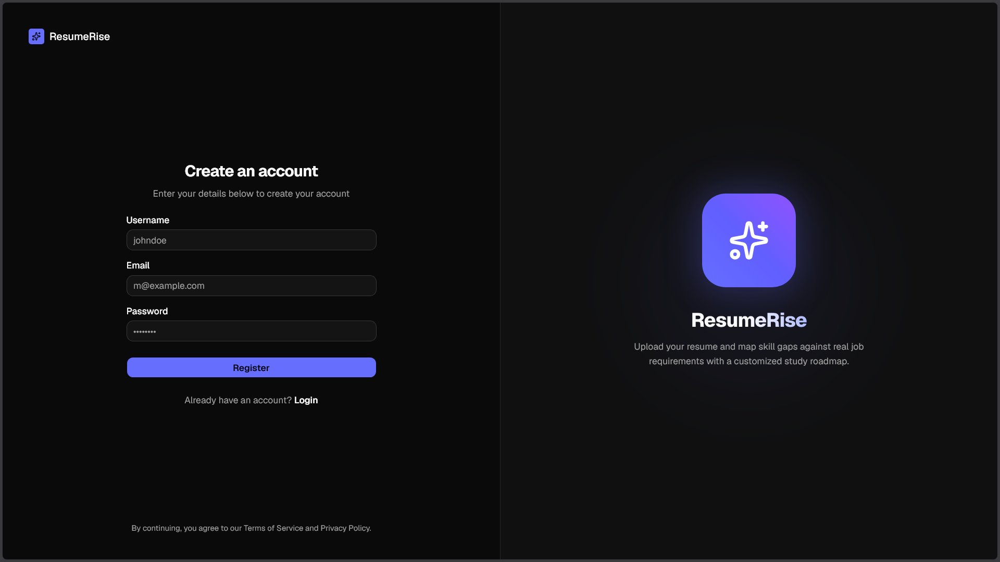
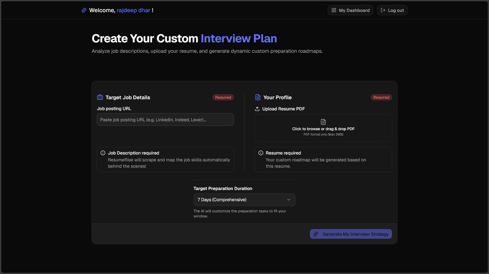
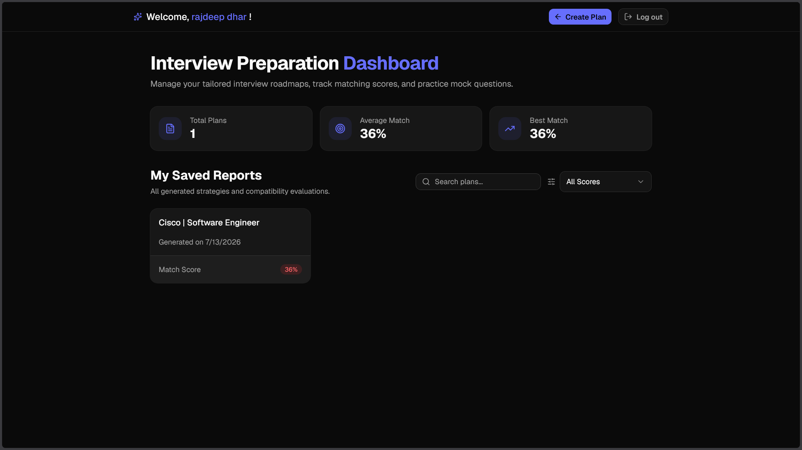
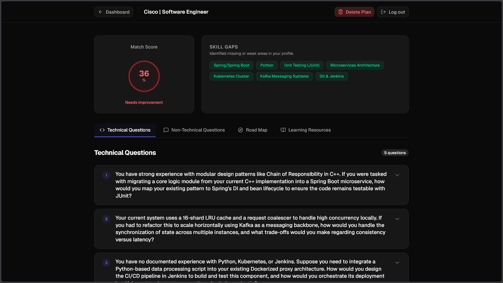
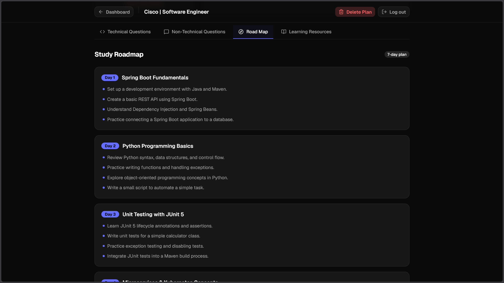
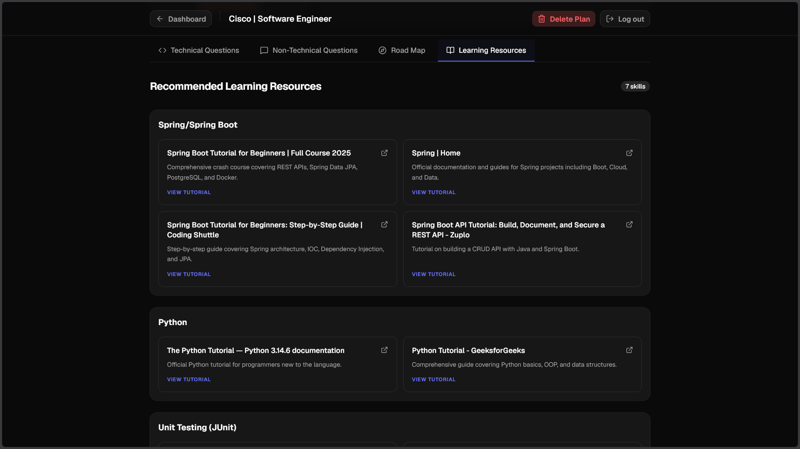
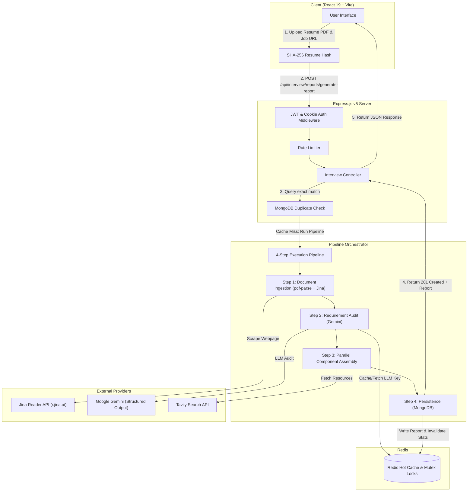

# ResumeRise

> **Production-grade, AI-driven interview strategy engine that analyzes resume PDFs against live job descriptions to generate personalized, priority-weighted preparation roadmaps.**

[](https://nodejs.org/)
[](https://expressjs.com/)
[](https://react.dev/)
[](https://vitejs.dev/)
[](https://redis.io/)
[](https://www.mongodb.com/)
[](https://ai.google.dev/)
[](https://tailwindcss.com/)

---

## Overview

Candidates applying for software engineering roles face a persistent challenge: manually cross-referencing multi-page resumes against complex job descriptions is time-consuming, highly subjective, and inefficient. Standard tools fail to quantify technical skill gaps or produce actionable, prioritized study strategies.

**ResumeRise** solves this by providing an automated interview preparation engine. Given a candidate's resume PDF and a target job posting URL, ResumeRise extracts, anonymizes, parses, and evaluates the candidate's profile against job requirements in under 30 seconds.

### Key Capabilities
- **Automated Web Ingestion**: Dynamically fetches and cleans JavaScript-rendered job postings using the Jina Reader API.
- **Privacy-Preserving PII Redaction**: Strips sensitive personal identifiable information (emails, phone numbers, personal names) via a multi-pass hybrid pipeline (Regex + NLP Entity Recognition) before transmitting text to LLM providers.
- **Streamlined Pipeline Architecture**: Orchestrates multi-step LLM synthesis efficiently to handle complex evaluation tasks in a single request lifecycle.
- **Thundering Herd & Cache Optimization**: Employs SHA-256 client-side document hashing alongside distributed Redis Mutex locks (`SETNX`) to prevent redundant scraping, duplicate web searches, and duplicate LLM invocations.
- **Deterministic Match Scoring**: Evaluates candidate fit using a priority-weighted, complexity-scaled mathematical scoring model that enforces penalty caps for missing core competencies.

---

## Application Screenshots

<table>
  <tr>
    <td align="center"><b>Register</b></td>
    <td align="center"><b>Create Plan</b></td>
  </tr>
  <tr>
    <td></td>
    <td></td>
  </tr>
  <tr>
    <td align="center"><b>Dashboard</b></td>
    <td align="center"><b>Report Overview &amp; Skill Gaps</b></td>
  </tr>
  <tr>
    <td></td>
    <td></td>
  </tr>
  <tr>
    <td align="center"><b>Technical Questions</b></td>
    <td align="center"><b>Non-Technical Questions</b></td>
  </tr>
  <tr>
    <td></td>
    <td></td>
  </tr>
  <tr>
    <td align="center"><b>Study Roadmap</b></td>
    <td align="center"><b>Learning Resources</b></td>
  </tr>
  <tr>
    <td></td>
    <td></td>
  </tr>
</table>

---

## Architecture & System Design

ResumeRise utilizes a synchronous pipeline architecture designed for fast end-to-end processing while maintaining strict duplicate request coalescing.



### Request & Processing Flow

1. **Ingestion & Validation**: The user submits a resume PDF and a target job posting URL. The client computes a SHA-256 hash of the PDF. The Express API checks MongoDB for an existing identical report for the user. On a cache hit, it returns the existing report instantly.
2. **Synchronous Pipeline Processing**: On a cache miss, the Express controller triggers a 4-step pipeline directly:
   - **Step 1 (Ingest)**: Extracts text from the PDF using `pdf-parse`, anonymizes PII using `compromise` + Regex, and fetches clean markdown from the job URL via Jina Reader.
   - **Step 2 (Audit)**: Maps anonymized technical and non-technical candidate experience against job requirements using Google Gemini with Zod structured output. Results are cached in Redis under SHA-256 payload hashes (`cache:llm:*`).
   - **Step 3 (Assemble)**: Executes parallel component generators to calculate match scores, build a multi-day study plan, craft technical/behavioral interview questions, and query Tavily for curated documentation links.
   - **Step 4 (Persist)**: Writes the structured `InterviewReport` document to MongoDB Atlas and invalidates the user's dashboard statistics cache key in Redis (`stats:<userId>`).
3. **Completion**: The API responds with `201 Created` returning the fully populated structured report for immediate rendering on the frontend.

---

## Tech Stack

| Domain | Technology | Purpose |
|---|---|---|
| **Runtime** | Node.js (v18+ ES Modules) | High-performance event-driven execution environment |
| **Backend Framework** | Express.js v5 (`express@^5.2.1`) | Core HTTP API gateway and router |
| **Database** | MongoDB Atlas (`mongoose@^9.3.0`) | Primary document store for users, resumes, job descriptions, and reports |
| **Cache & Distributed Locks** | Redis (`ioredis@^5.11.1`) | Hot cache layer and distributed mutex locks |
| **AI Orchestration** | LangChain (`@langchain/core`, `@langchain/google`) | Structured output extraction via Google Gemini models |
| **Web Scraping** | Jina Reader API (`r.jina.ai`) | Server-side HTML-to-Markdown conversion for dynamic job pages |
| **Web Search** | Tavily API (`@langchain/tavily`) | Real-time discovery of free developer documentation and learning resources |
| **PDF & PII Processing** | `pdf-parse` & `compromise` | Zero-disk buffer PDF text extraction and NLP-based PII redaction |
| **Authentication & Security** | JWT (`jsonwebtoken`), `bcryptjs`, `helmet` | HttpOnly refresh cookie flow, token verification, and security headers |
| **Rate Limiting** | `express-rate-limit` | In-memory API rate limiting per IP/User |
| **Logging** | Pino (`pino@^10.3.1`, `pino-http`) | High-performance structured JSON logging with automatic secret redaction |
| **Frontend Framework** | React 19 + Vite 8 | Single Page Application framework and fast build toolchain |
| **Styling & UI** | Tailwind CSS v4, Base UI, Lucide Icons | Component-driven responsive styling system and UI icons |

---

## Engineering Highlights

### 1. Request Coalescing & Distributed Mutex Locks
When multiple users request analysis for the same popular job URL or identical skill gap, unthrottled scraping or web search introduces redundant API charges and latency. ResumeRise uses a Redis-backed distributed lock (`SET lock:<key> 1 EX lockTtl NX`):
- **Web Scraping Coalescing**: If a job URL is currently being scraped by Request A, Request B fails to acquire the lock and enters a polling loop with jitter against the Redis cache (`jd:<url>`), reusing Request A's result upon completion.
- **Search Request Coalescing**: Parallel searches for identical skill gaps (e.g., "Docker Containerization") acquire a lock (`lock:search:<term>`), preventing duplicate Tavily search requests.

### 2. Priority-Weighted & Complexity-Scaled Match Algorithm
Rather than relying on basic fuzzy keyword counts or non-deterministic LLM score guesses, candidate match scoring uses a deterministic mathematical algorithm (`src/utils/score_calculator.js`):

$$\text{Weighted Score} = \frac{\sum (\text{Term Score}_i \times \text{Priority Weight}_i)}{\text{Total Weight}}$$

- **Priority Weights**: `REQUIRED` (1.0), `PREFERRED` (0.65), `NICE_TO_HAVE` (0.35).
- **Complexity Multipliers**: `PRODUCTION` (1.0), `ADVANCED` (0.98), `INTERMEDIATE` (0.90), `BASIC` (0.80), `TRIVIAL` (0.65).
- **Sparse Description Smoothing**: Introduces minimum weight padding (`MIN_JD_WEIGHT = 8.0`) to avoid score distortion on short job descriptions.
- **Critical Skill Penalty Caps**: If a candidate lacks essential `REQUIRED` competencies, the final score is hard-capped (e.g., capped at 80% if $\ge 1$ required skill is missing; capped at 70% if $\ge 3$ are missing).

### 3. Zero-Disk Privacy-First PII Redaction
Candidate resumes contain sensitive personal details (names, personal phone numbers, email addresses). The anonymizer pipeline (`src/utils/anonymizer.js`):
1. Accepts raw PDF buffers in memory via `multer.memoryStorage()`, keeping zero files on disk.
2. Applies high-speed regular expressions to strip email patterns and telephone numbers (`[REDACTED_EMAIL]`, `[REDACTED_PHONE]`).
3. Passes extracted text through `compromise` NLP Named Entity Recognition (NER) to detect and redact personal names (`[REDACTED_NAME]`).
4. Ensures clean, anonymized text is passed to external LLM providers and persistent caches.

### 4. Multi-Tiered Intelligent Caching
- **Level 1 (LLM Call Cache)**: Input payload hashing via SHA-256 (`withLlmCache`) caches LLM evaluation outputs in Redis for 24 hours (`cache:llm:<tool>:<hash>`).
- **Level 2 (Scraper & Search Cache)**: Scraped job descriptions and Tavily search resource lists are cached in Redis (24h/48h TTL) and backed by MongoDB persistent collections.
- **Level 3 (User Dashboard Aggregation Cache)**: User statistics (`totalPlans`, `averageMatch`, `bestMatch`) are cached in Redis (`stats:<userId>`) and selectively invalidated only upon report creation or deletion.

---

## Project Structure

```
ResumeRise/
├── backend/
│   ├── render.yaml                    # Render infrastructure deployment blueprint
│   ├── package.json                   # Backend dependencies and execution scripts
│   └── src/
│       ├── server.js                  # Primary API Express server entry point & graceful shutdown
│       ├── app.js                     # Express app configuration & middleware pipeline
│       ├── config/                    # Database, Redis, and LangChain LLM configurations
│       ├── controllers/               # Auth and Interview Report API route controllers
│       ├── middlewares/               # Rate limiters, JWT verification, validation, error handler
│       ├── models/                    # Mongoose schemas (User, Report, JobDescription, Resume)
│       ├── pipeline.js/               # Modular 4-step report generation orchestrator
│       ├── prompts/                   # Structured prompt templates for Gemini models
│       ├── routes/                    # Express routing endpoints
│       ├── schemas/                   # Zod schemas for structured LLM parsing
│       ├── services/                  # Step implementations (Ingest, Audit, Assemble, Persist)
│       ├── tools/                     # Modular tool execution scripts (Scraper, Scorer, Planner)
│       └── utils/                     # Anonymizer, score calculator, logger, LLM cache wrapper
│
└── frontend/
    ├── package.json                   # Frontend dependencies and Vite scripts
    ├── vite.config.js                 # Vite build configuration & plugin setup
    └── src/
        ├── App.jsx                    # Root Application component & provider wrappers
        ├── app.routes.jsx             # React Router v7 route definitions
        ├── components/                # Modular UI components (Dashboard, Report View, Auth)
        ├── context/                   # React Context state management (Auth, Interview)
        ├── hooks/                     # Custom React hooks (useAuth, useInterview)
        ├── lib/                       # Axios client setup, token refresh interceptors, utils
        ├── pages/                     # Application views (Login, Register, Home, Report Details)
        └── services/                  # API client service wrappers (auth.api.js, interview.api.js)
```

---

## API Overview

### Authentication Endpoint Group (`/api/auth`)

| Method | Endpoint | Access | Description |
|---|---|---|---|
| `POST` | `/api/auth/register` | Public | Register new user account (Rate limited: 5 req/hr) |
| `POST` | `/api/auth/login` | Public | Authenticate user; returns Access Token & sets Refresh Cookie (Rate limited: 10 req/5min) |
| `POST` | `/api/auth/refresh` | Public | Issue new Access Token using valid HttpOnly Refresh Cookie |
| `POST` | `/api/auth/logout` | Private | Clear HttpOnly Refresh Cookie and invalidate session |
| `GET` | `/api/auth/get-me` | Private | Retrieve authenticated user profile |

### Interview Report Endpoint Group (`/api/interview`)

| Method | Endpoint | Access | Description |
|---|---|---|---|
| `POST` | `/api/interview/reports` | Private | Submit candidate profile & Job URL; queues generation job and returns `202 Accepted` + `{ jobId }` |
| `GET` | `/api/interview/reports/job/:jobId` | Private | Poll status of a queued report generation job. Returns `{ status, reportId, error }` |
| `GET` | `/api/interview/reports/:reportId` | Private | Fetch complete structured interview report by ID |
| `GET` | `/api/interview/reports` | Private | List user's reports with pagination (`page`, `limit`), search query, and minimum score filters |
| `GET` | `/api/interview/reports/stats` | Private | Retrieve user dashboard stats |
| `DELETE` | `/api/interview/reports/:reportId` | Private | Delete interview report and invalidate user stats cache |

---

## Installation & Setup

### Prerequisites
- **Node.js**: v18.0.0 or higher
- **MongoDB**: Atlas Cluster or local MongoDB instance (v6.0+)
- **Redis**: Local instance or managed service (e.g., Redis Cloud, Upstash)
- **API Keys**:
  - [Google Gemini API Key](https://aistudio.google.com/)
  - [Tavily Search API Key](https://tavily.com/)
  - *(Optional)* [Jina Reader API Key](https://jina.ai/)

### 1. Clone Repository

```bash
git clone https://github.com/Rajdeep-Dhar-06/ResumeRise.git
cd ResumeRise
```

### 2. Backend Setup

```bash
cd backend
npm install
```

Create a `.env` file in `backend/.env`:

```env
# Server Configuration
PORT=5000
NODE_ENV=development
LOG_LEVEL=info
CORS_ORIGIN=http://localhost:5173

# Database & Redis Connections
MONGO_URI=mongodb+srv://<username>:<password>@cluster.mongodb.net/resumerise?retryWrites=true&w=majority
REDIS_URL=redis://localhost:6379

# Authentication Secrets
ACCESS_TOKEN_SECRET=your_super_secret_access_key_32_bytes_min
REFRESH_TOKEN_SECRET=your_super_secret_refresh_key_32_bytes_min

# LLM & Search API Keys
GEMINI_API_KEY=AIzaSy...
TAVILY_API_KEY=tvly-...
JINA_API_KEY=jina_...
```

Start backend development server:

```bash
npm run dev
```
*API Server starts on `http://localhost:5000`.*

### 3. Frontend Setup

```bash
cd ../frontend
npm install
```

Create a `.env` file in `frontend/.env`:

```env
VITE_API_BASE_URL=http://localhost:5000
```

Start frontend development server:

```bash
npm run dev
```
*Application opens on `http://localhost:5173`.*

---

## Configuration

| Environment Variable | Required | Default | Description |
|---|---|---|---|
| `PORT` | No | `5000` / `8000` | Port number for Express Web API server |
| `NODE_ENV` | Yes | `development` | Environment mode (`development` / `production`) |
| `LOG_LEVEL` | No | `info` | Logging verbosity for Pino logger (`debug`, `info`, `warn`, `error`) |
| `CORS_ORIGIN` | Yes | `http://localhost:5173` | Allowed origin for Cross-Origin Resource Sharing |
| `MONGO_URI` | Yes | — | MongoDB connection string URI |
| `REDIS_URL` | Yes | — | Redis connection URL (`redis://:password@host:port`) |
| `ACCESS_TOKEN_SECRET` | Yes | — | Secret key for signing short-lived Access JWTs |
| `REFRESH_TOKEN_SECRET` | Yes | — | Secret key for signing long-lived Refresh JWTs |
| `GEMINI_API_KEY` | Yes | — | Google AI Studio key for Gemini model invocations |
| `TAVILY_API_KEY` | Yes | — | Tavily API key for search resource fetching |
| `JINA_API_KEY` | No | — | Optional Bearer token for higher Jina Reader rate limits |

---

## Reliability & Security

- **Structured JSON Logging & Redaction**: Pino automatically redacts authorization headers, cookies, and password parameters before emitting log events.
- **Graceful Process Shutdown**: Captures `SIGTERM` and `SIGINT` signals across the API process to drain active HTTP connections and close Redis and Mongoose connections cleanly.
- **Input Sanitization & Type Safety**: Strict schema validation using Zod for HTTP inputs and LangChain structured outputs.
- **CSRF & Token Security**: Refresh tokens stored exclusively in `httpOnly`, `SameSite=Lax` (or `Strict`), `Secure` cookies.